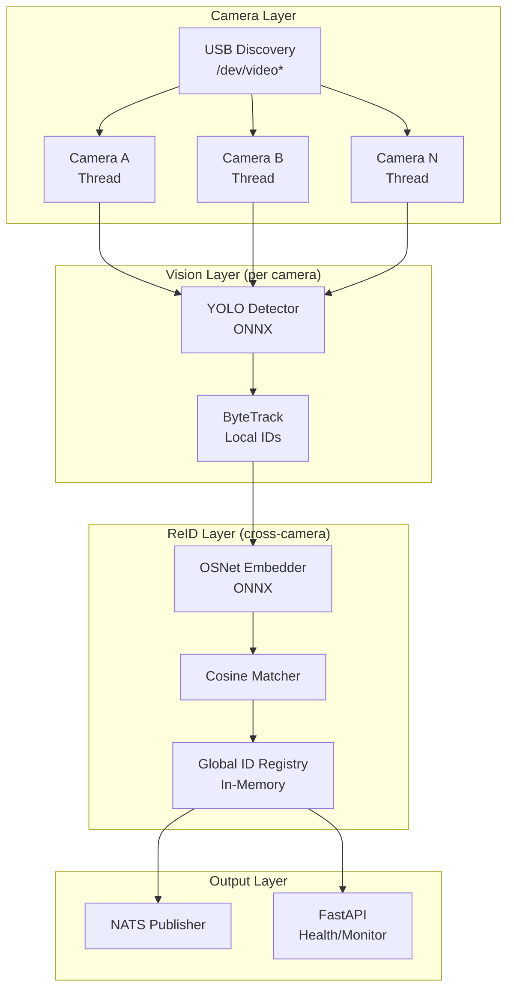
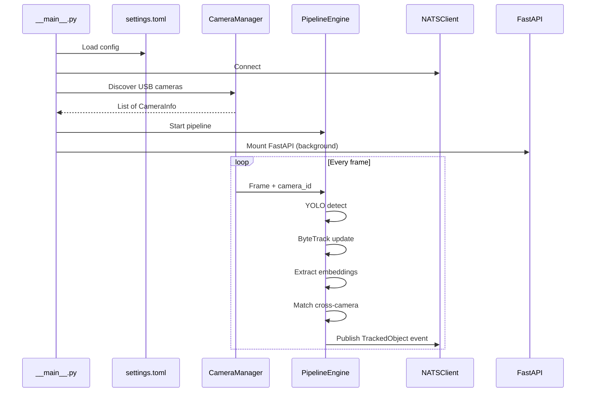

# Estructura de pmai-mai-core

## Contexto y Restricciones Criticas

- **Hardware**: NucBox G2 con Intel N100 (4 cores, sin GPU CUDA). Toda inferencia debe ejecutarse en CPU, optimizada con **ONNX Runtime** u **OpenVINO**.
- **Modelo de vision**: YOLO11n/s (del submodulo `pmai-model-vision`), exportado a ONNX para inferencia en CPU.
- **Re-ID**: Se recomienda **OSNet-ain-x0.25** (modelo mas liviano de torchreid, ~500KB) exportado a ONNX, con matching por cosine similarity.
- **Comunicacion**: NATS pub/sub para mensajeria entre microservicios.
- **Camaras**: USB, auto-descubiertas via `/dev/video`* + V4L2.

## Arquitectura General

El proceso principal es el **pipeline de procesamiento continuo** (no un servidor HTTP request-response). FastAPI se monta como componente secundario para health checks y monitoreo futuro.




## Modelo de Dominio (Objeto Tracked)

```python
from pydantic import BaseModel

class TrackedObject(BaseModel):
    id: int                          # ID local de tracking (por camara)
    global_id: str                   # ID global asignado por ReID
    label: str                       # Etiqueta de la deteccion (clase YOLO)
    confidence: float                # Confianza de deteccion
    bbox: tuple[int, int, int, int]  # xmin, ymin, xmax, ymax
    camera_id: str                   # ID de la camara de origen
    context: str | None = None       # Texto del LLM de contexto (futuro)
    sensors: dict[str, float] = {}   # Datos de sensores (futuro)
    embedding: list[float] = []      # Vector de embedding para ReID
```

## Estructura de Proyecto Propuesta

```
pmai-mai-core/
├── pyproject.toml                    # PEP 621 - dependencias + metadata
├── settings.toml                     # Configuracion runtime (camaras, modelos, NATS)
├── README.md
├── LICENSE
│
├── src/
│   └── pmai_core/
│       ├── __init__.py
│       ├── __main__.py               # Entry point: python -m pmai_core
│       ├── app.py                    # Bootstrap: inicia pipeline + API
│       ├── settings.py               # Lectura tipada de settings.toml (Pydantic Settings)
│       │
│       ├── domain/                   # Modelos de dominio (Pydantic)
│       │   ├── __init__.py
│       │   ├── tracked_object.py     # TrackedObject, Detection, BBox
│       │   ├── camera.py             # CameraInfo, CameraStatus
│       │   └── events.py             # Eventos para NATS (ObjectDetected, ObjectReIdentified)
│       │
│       ├── camera/                   # Subsistema de camaras
│       │   ├── __init__.py
│       │   ├── discovery.py          # Auto-descubrimiento USB via /dev/video* + V4L2
│       │   ├── capture.py            # CameraCapture: hilo por camara con queue de frames
│       │   └── manager.py            # CameraManager: orquesta todas las camaras
│       │
│       ├── vision/                   # Deteccion + tracking por camara
│       │   ├── __init__.py
│       │   ├── detector.py           # YOLODetector: wrapper ONNX Runtime
│       │   └── tracker.py            # ObjectTracker: ByteTrack para IDs locales
│       │
│       ├── reid/                     # Re-Identificacion multi-camara (Hito 2)
│       │   ├── __init__.py
│       │   ├── extractor.py          # EmbeddingExtractor: OSNet ONNX
│       │   ├── matcher.py            # CosineMatcher: comparacion de embeddings
│       │   └── registry.py           # GlobalRegistry: asignacion y gestion de IDs globales
│       │
│       ├── pipeline/                 # Orquestacion del flujo completo
│       │   ├── __init__.py
│       │   └── engine.py             # PipelineEngine: capture -> detect -> track -> reid
│       │
│       ├── messaging/                # Integracion NATS
│       │   ├── __init__.py
│       │   └── client.py             # NATSClient: publish/subscribe de eventos
│       │
│       └── api/                      # FastAPI (health + monitoreo)
│           ├── __init__.py
│           └── router.py             # Endpoints: /health, /cameras, /objects
│
└── tests/
    ├── __init__.py
    ├── test_discovery.py
    ├── test_detector.py
    └── test_reid.py
```

## Descubrimiento Automatico de Camaras USB

La estrategia en `camera/discovery.py`:

1. Enumerar `/dev/video*` filtrando con V4L2 (`v4l2-ctl --list-devices` o `ioctl` directo)
2. Filtrar dispositivos que realmente son camaras (no metadata/subdevices V4L2)
3. Validar que cada camara puede abrirse con `cv2.VideoCapture`
4. Retornar lista de `CameraInfo` con device path, nombre, y capacidades
5. Re-escaneo periodico para detectar camaras conectadas/desconectadas en caliente

## Pipeline de Procesamiento

El `PipelineEngine` es el corazon del sistema. Ejecuta un loop asyncio:

1. **CameraManager** lanza un thread por camara, cada uno pushea frames a una `queue.Queue`
2. **Engine** consume frames de todas las queues (round-robin o priorizado)
3. Por cada frame: `YOLODetector.detect()` -> `ObjectTracker.update()` -> `EmbeddingExtractor.extract()`
4. Periodicamente: `CosineMatcher.match_across_cameras()` actualiza `GlobalRegistry`
5. Publica eventos via `NATSClient` cuando se detecta/re-identifica un objeto

## Dependencias Principales (`pyproject.toml`)

- **opencv-python-headless**: captura de video y procesamiento de imagen
- **onnxruntime**: inferencia de modelos (YOLO + OSNet) en CPU, optimizado para Intel
- **ultralytics**: exportacion de YOLO a ONNX y tracking (ByteTrack)
- **pydantic** + **pydantic-settings**: modelos tipados y configuracion
- **nats-py**: cliente NATS asincrono
- **fastapi** + **uvicorn**: API REST para monitoreo
- **numpy**: operaciones numericas
- **tomli** / **tomllib** (Python 3.11+): lectura de TOML
- **structlog**: logging estructurado

## Recomendacion ReID para Intel N100

Dado el hardware limitado (sin GPU), se recomienda:

- **Modelo**: OSNet-ain-x0.25 exportado a ONNX (~500KB, 0.25x width multiplier)
- **Embedding size**: 512-dim vector por deteccion
- **Matching**: Cosine similarity con threshold configurable (default ~0.7)
- **Galeria**: Diccionario en memoria `{global_id: list[embedding]}` con promedio movil
- **Optimizacion**: Extraer embeddings solo cada N frames o cuando cambia el track, no en cada frame

Alternativa si OSNet es muy pesado: usar los feature maps del propio YOLO como embeddings (menos precision pero zero overhead adicional).

## Configuracion (`settings.toml`)

```toml
[app]
name = "pmai-core"
log_level = "INFO"

[camera]
auto_discover = true
poll_interval_seconds = 10
default_resolution = [640, 480]
default_fps = 15

[vision]
model_path = "models/yolo11n.onnx"
confidence_threshold = 0.5
device = "cpu"

[reid]
model_path = "models/osnet_ain_x0_25.onnx"
similarity_threshold = 0.7
embedding_update_interval = 5

[nats]
url = "nats://localhost:4222"
subject_prefix = "pmai"

[api]
host = "0.0.0.0"
port = 8000
```

## Flujo de Ejecucion




## Notas Importantes

- **Rendimiento en N100**: Con YOLO11n en ONNX y resolucion 640x480, se esperan ~5-10 FPS por camara. Con 2+ camaras, es esencial procesar frames de forma alternada o reducir la frecuencia de deteccion.
- **Thread model**: Un thread por camara (I/O bound), pero la inferencia de modelos debe ser secuencial o con un pool limitado dado que el N100 solo tiene 4 cores.
- **Escalabilidad**: La estructura modular permite en el futuro mover componentes a procesos separados o nodos distintos comunicados por NATS.

